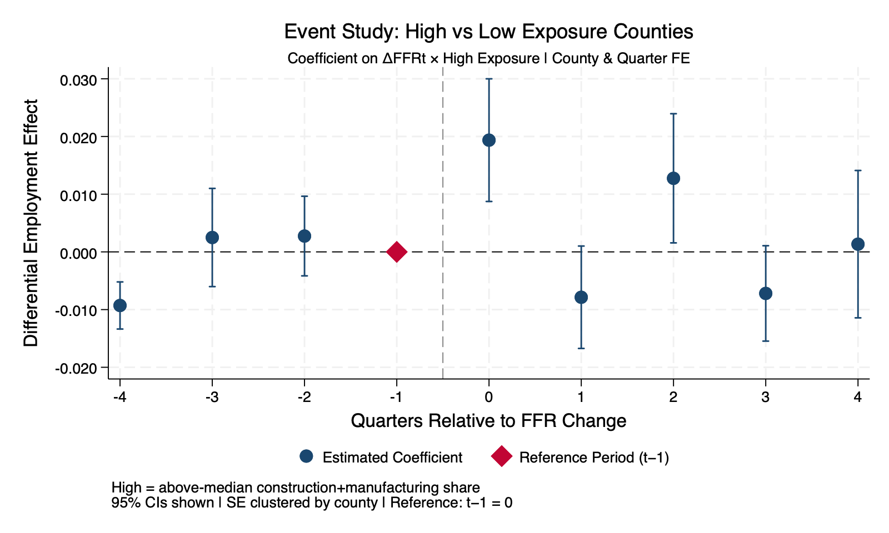

# Monetary Policy & Local Labor Markets

**State-versus-County Aggregation and Identification in U.S. Monetary Policy
Transmission to Employment, 2002–2019**

📄 **Read the papers:** [time-series report](report.pdf) · [causal DiD paper](causal-did/paper.pdf)

A two-part research program on how monetary policy transmits to local employment,
by Abdallah Dalis (DePaul University):

- **`causal-did/`** — a shift-share **difference-in-differences** (ECO 510, Causal
  Inference): do counties with higher predetermined shares of rate-sensitive
  industries respond differently when the Fed moves the funds rate? Two-way fixed
  effects, distributed lags, pre-trend/placebo tests. *Submitted for the NABE
  Mennis Award.*
- **time-series** (root, ECO 508, Time Series): reduced-form **VAR**, recursive
  **SVAR**, Jordà **local projections** with Bauer–Swanson high-frequency
  surprises, and a **random-forest** benchmark.

Together they tackle the same question from the **causal** and the **time-series**
sides, and across **state-versus-county aggregation**.

The R script below reproduces the time-series half end to end: it downloads the
FRED series and Bauer–Swanson surprises, reads the bundled BLS QCEW / Census CBP
panels, and regenerates every figure and table. The DiD half is in `causal-did/`
(Stata) with its own paper, figures, and tables.

## Question

Does the measured employment response to monetary-policy tightening depend on the
**level of geographic aggregation** (state vs. county) and on the **identification
strategy**? A naïve specification can produce the well-known "price/employment
puzzle" — output or employment appearing to *rise* after a contraction — which is
an artifact of endogeneity rather than a real effect.

## Methods

Four complementary time-series approaches, layered from reduced-form to
identified to machine-learning:

1. **Reduced-form VAR** — baseline dynamics across macro aggregates
2. **Recursive SVAR** — Cholesky-identified structural shocks (Kilian-style)
3. **Jordà local projections** — impulse responses using Bauer–Swanson
   high-frequency FOMC surprises as the shock (clean external identification)
4. **Random forest** — nonlinear cross-validated benchmark for the
   surprise → employment mapping

## Headline result

Under clean identification (local projections with high-frequency surprises), the
**contractionary sign is recovered**: the puzzling positive employment response to
tightening in the naïve specification is an aggregation/endogeneity artifact, not
a structural relationship. Granger test p ≈ 0.0031; the random-forest forecast
correlation with the surprise channel is near zero, consistent with the
identified-shock interpretation.


## Causal DiD half (`causal-did/`)

Estimating equation (main spec):

```
ln(emp_it) = β1·ΔFFR_t + β3·(ΔFFR_t × exp_sens_i) + α_i + γ_t + ε_it
```

where `exp_sens_i` is a county's **predetermined** (CBP 2002) construction +
manufacturing share, with county (`α_i`) and quarter (`γ_t`) fixed effects and SEs
clustered by county. Specifications include a 4-lag distributed-lag headline,
base-year robustness (CBP 2003/2013), and pre-trend/placebo (leads) tests.

**Result:** a one-unit rise in the federal funds rate is associated with a ~4.2%
larger cumulative 4-quarter employment gain in high-exposure counties — consistent
with cyclical amplification during Fed hiking cycles. Stata (`01_clean_data.do`,
`02_analysis.do`); see `causal-did/paper.pdf`.



## Reproduce

```r
# install.packages(c("haven","readxl","dplyr","tidyr","vars",
#                    "sandwich","lmtest","randomForest","ggplot2","tseries"))

setwd("path/to/this/repo")   # script reads ./data and writes ./figures, ./tables
source("monetary_policy_labor.R")
```

The script caches FRED + Bauer–Swanson downloads into `data/` and regenerates
`figures/fig1–fig8` and the tables. Minor differences in VAR bootstrap bands or
random-forest seeds across runs are expected.

## Layout

- **`monetary_policy_labor.R`** — full reproducible time-series pipeline
- **`report.pdf`** / **`report.tex`** — time-series written report and LaTeX source
- **`figures/`** — fig1–fig8 (series, VAR/SVAR IRFs, sign-flip, LP, random forest)
- **`tables/`** — summary stats, ADF/KPSS, VAR lag selection, FEVD, sign-flip, RF CV
- **`data/`** — inputs: FRED CSVs, Bauer–Swanson surprises, BLS QCEW panel, Census CBP exposure
- **`causal-did/`** — the shift-share DiD half: Stata code, `paper.pdf`, figures, tables

## Data sources

FRED (CPIAUCSL, FEDFUNDS, PAYEMS) · Bauer–Swanson monetary-policy surprises ·
BLS Quarterly Census of Employment and Wages (QCEW) · Census County Business
Patterns (CBP). All public.
