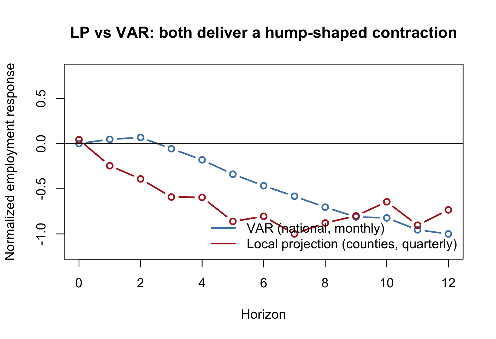

# Monetary Policy & Local Labor Markets

**State-versus-County Aggregation and Identification in U.S. Monetary Policy
Transmission to Employment, 2002–2019**

Final project for ECO 508 (Predictive Analytics & Time Series Analysis), DePaul
University — Abdallah Dalis.

A single R script reproduces the entire analysis end to end: it downloads the
FRED series and Bauer–Swanson high-frequency monetary-policy surprises, reads the
bundled BLS QCEW / Census CBP panels, and regenerates every figure and table in
the report.

## Question

Does the measured employment response to monetary-policy tightening depend on the
**level of geographic aggregation** (state vs. county) and on the **identification
strategy**? A naïve specification can produce the well-known "price/employment
puzzle" — output or employment appearing to *rise* after a contraction — which is
an artifact of endogeneity rather than a real effect.

## Methods

Four complementary time-series approaches, layered from reduced-form to
identified to machine-learning:

1. **Reduced-form VAR** — baseline dynamics across macro aggregates
2. **Recursive SVAR** — Cholesky-identified structural shocks (Kilian-style)
3. **Jordà local projections** — impulse responses using Bauer–Swanson
   high-frequency FOMC surprises as the shock (clean external identification)
4. **Random forest** — nonlinear cross-validated benchmark for the
   surprise → employment mapping

## Headline result

Under clean identification (local projections with high-frequency surprises), the
**contractionary sign is recovered**: the puzzling positive employment response to
tightening in the naïve specification is an aggregation/endogeneity artifact, not
a structural relationship. Granger test p ≈ 0.0031; the random-forest forecast
correlation with the surprise channel is near zero, consistent with the
identified-shock interpretation.



## Reproduce

```r
# install.packages(c("haven","readxl","dplyr","tidyr","vars",
#                    "sandwich","lmtest","randomForest","ggplot2","tseries"))

setwd("path/to/this/repo")   # script reads ./data and writes ./figures, ./tables
source("monetary_policy_labor.R")
```

The script caches FRED + Bauer–Swanson downloads into `data/` and regenerates
`figures/fig1–fig8` and the tables. Minor differences in VAR bootstrap bands or
random-forest seeds across runs are expected.

## Layout

- **`monetary_policy_labor.R`** — full reproducible pipeline
- **`report.pdf`** / **`report.tex`** — written report and LaTeX source
- **`figures/`** — fig1–fig8 (series, VAR/SVAR IRFs, sign-flip, LP, random forest)
- **`tables/`** — summary stats, ADF/KPSS, VAR lag selection, FEVD, sign-flip, RF CV
- **`data/`** — inputs: FRED CSVs, Bauer–Swanson surprises, BLS QCEW panel, Census CBP exposure

## Data sources

FRED (CPIAUCSL, FEDFUNDS, PAYEMS) · Bauer–Swanson monetary-policy surprises ·
BLS Quarterly Census of Employment and Wages (QCEW) · Census County Business
Patterns (CBP). All public.
